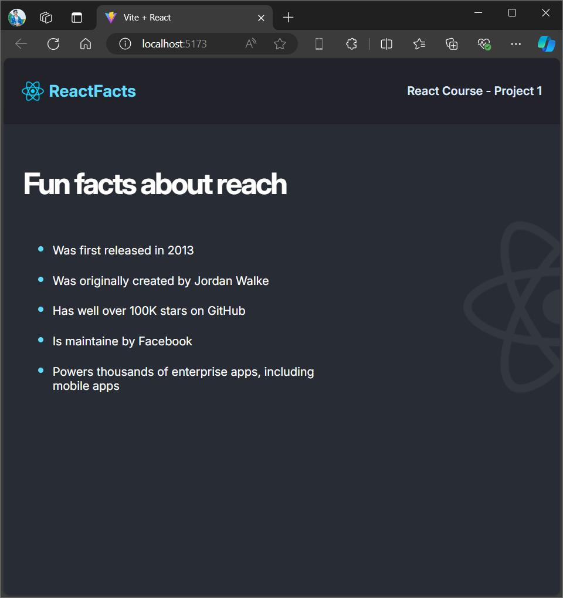

# Static React App

This project showcases a static webpage created using React, focusing on fundamental React concepts such as component creation, CSS integration, and component management. The project emphasizes clean code structure, effective styling, and efficient component organization.

This project is a great starting point for understanding the basics of React, setting up a React app with Vite, and learning about organizing a React application's folder structure.

## Key Features:
- **Component-Based Architecture**: Demonstrates the use of React components to build modular and reusable UI elements.
- **Styling with CSS**: Shows how to integrate and apply CSS within a React app for styling and layout.
- **React Setup with Vite**: Includes steps for setting up a React application using Vite and understanding folder structure.

## Project Overview:
Below is a preview of how the static webpage looks:

---

