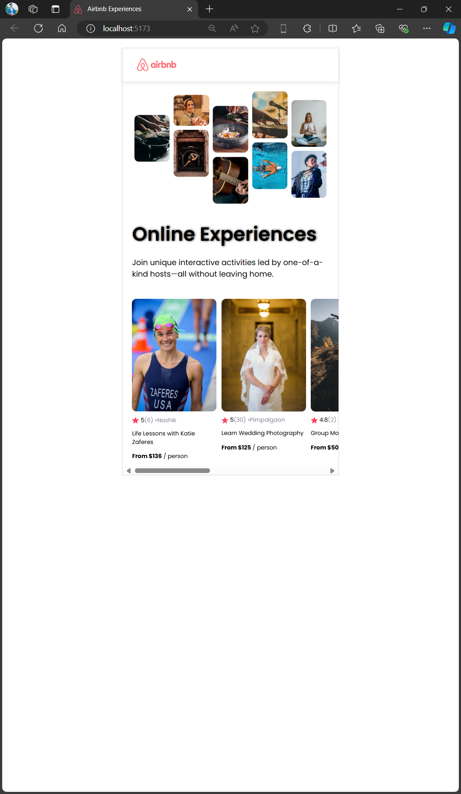

## Overview

In this project, I created a simple React application that displays a list of "experiences" similar to those found on Airbnb. The experiences are rendered as cards, each displaying an image, title, price, rating, and other relevant details. This project helped me understand how to efficiently use props, map over arrays of data, and create reusable components.

## What I Learned

- **Props**: I learned how to pass data to components using props. This allowed me to create flexible and reusable components that can accept different data inputs.
  
- **Mapping over Arrays**: I utilized the `map()` method to iterate over an array of objects representing the experiences. This technique allowed me to dynamically generate a list of cards, each corresponding to an item in the data array.
  
- **Reusable Components**: I created a reusable `Card` component that could display various details such as images, titles, and ratings. This component was then reused for each experience in the list.
  
- **Image Management**: I learned how to handle image paths correctly in React, ensuring that images from both the `public` and `src` directories are loaded properly.

## Screenshots

Here are some screenshots of the web application:

